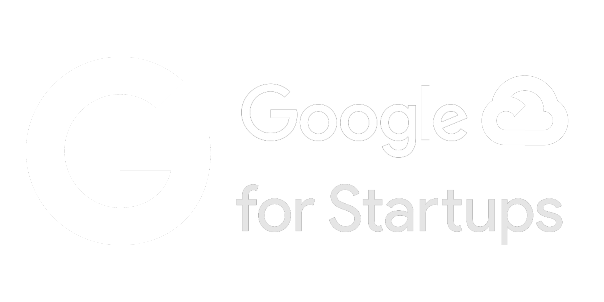
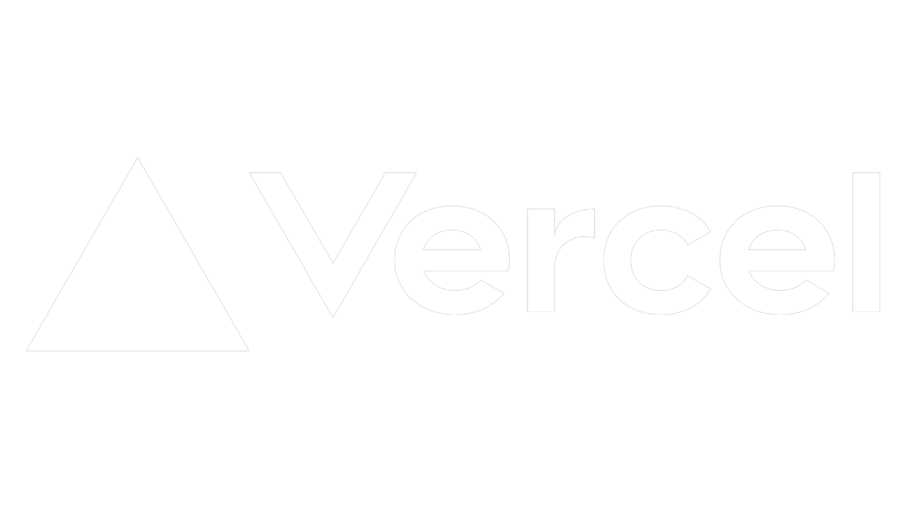
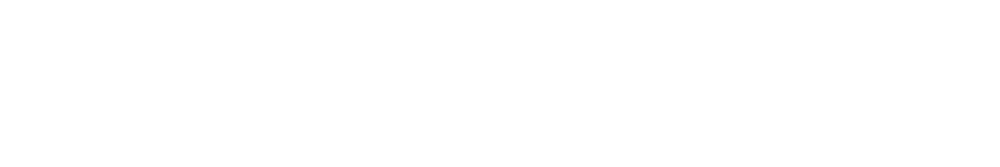
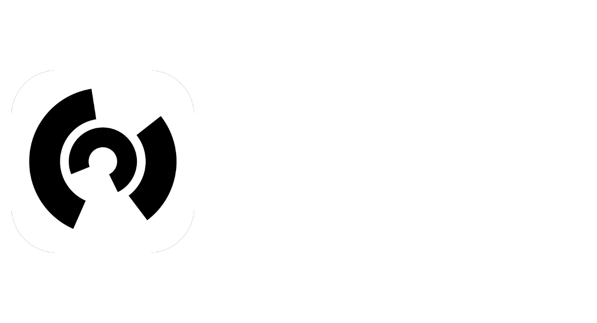
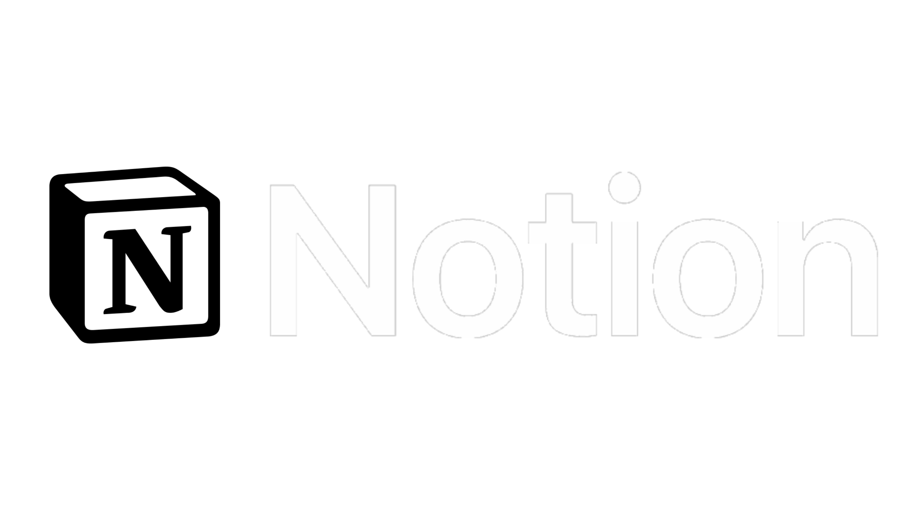
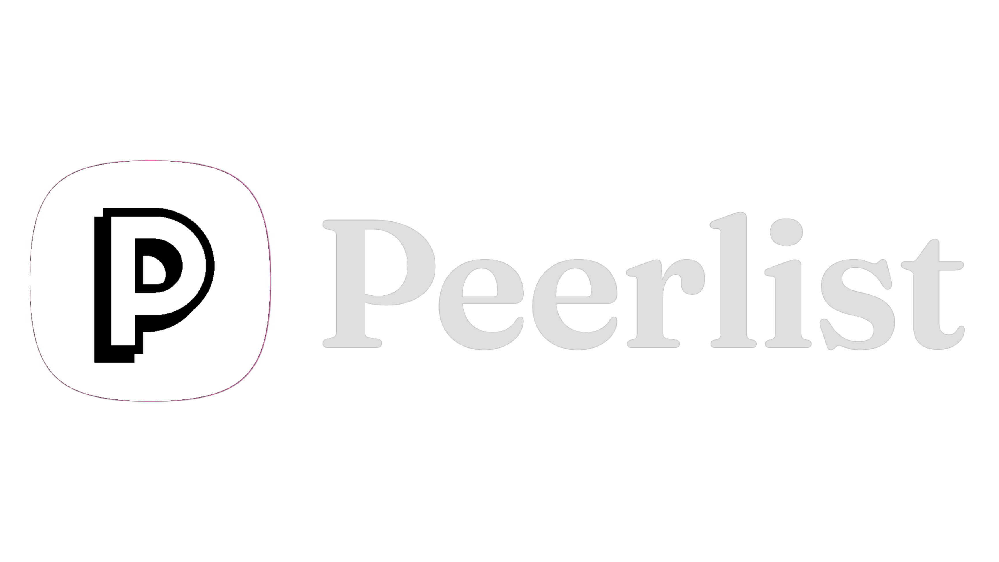

# Welcome to SheBright 👋

## About Us
SheBright is a girls' empowerment community dedicated to fostering personal growth, professional development, and innovation. We believe in creating a supportive and inclusive space for women to thrive.

## What We Do
- 🚀 Empower girls and women through education and mentorship
- 💡 Provide resources for professional and personal development
- 🤝 Foster a collaborative and inclusive community

## Get Involved
We welcome contributors of all levels! Here's how you can help:
- 🛠 **Contribute**: Check out our [open issues](https://github.com/orgs/SheBright/projects) and start contributing.
- 🌍 **Join the Community**: Connect with us on our Telegram group.
- ⭐ **Support Us**: If you like what we do, give our repositories a star!

  

<h1 align="center">Supported By </h1>
<table>
  <tr>
    <td align="center">
      
    </td>
    <td align="center">
      
    </td>
    <td align="center">
      
    </td>
    <td align="center">
      
    </td>
    <td align="center">
      
    </td>
  </tr>
  <tr>
    <td align="center">
      
    </td>
    <td align="center">
      
    </td>
    <td align="center">
      
    </td>
    <td align="center">
      
    </td>
    <td align="center">
      
    </td>
  </tr>
</table>

Happy Coding! 🚀
